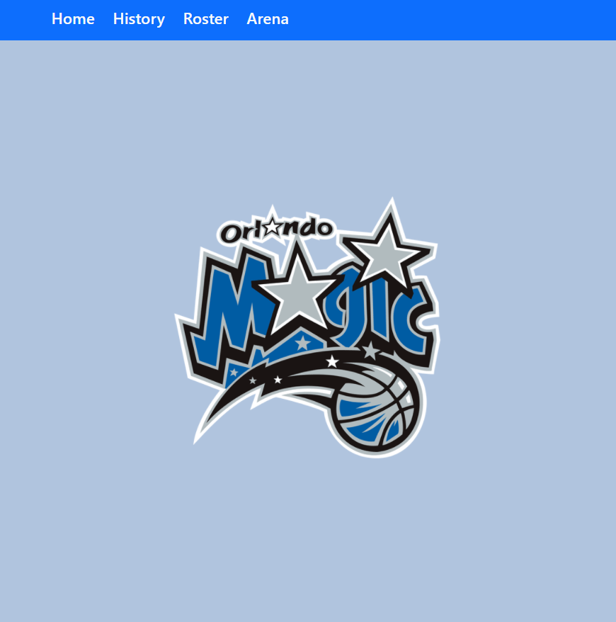
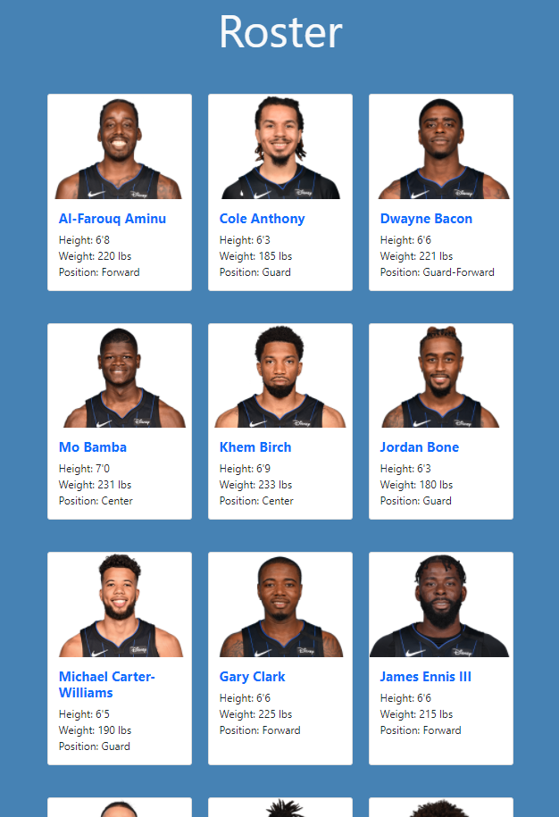

# Bootstrap-NBA-Team-Site
An informational NBA team site about the Orlando Magic; implemented and created primarily with Bootstrap, along with minimal CSS stylings

 

# Screenshots

 

# Technologies Used & Features
**Implemented using:** 
* Bootstrap
* HTML
* CSS

 

**Features:** 
* 4 'pages' within webpage: 1)Home 2)History 3)Roster 4)Arena
* Home page with navbar(responsive) and an image; navbar was  implemented using Bootstrap nav classes
* History page that is responsive using Bootstrap 'card'
* Roster page utilizing Bootstrap 'grid' and 'cards' (responsive breakpoints);  each card has the player's picture and some statistics
* Arena page has responsive image(through Bootstrap 'img-fluid' class)  with text that is also responsive
* Bootstrap was used through the CDN: In 'head' portion for styling  & script CDN for JS at bottom of 'body' portion;
* Fontawesome CDN used for icon
